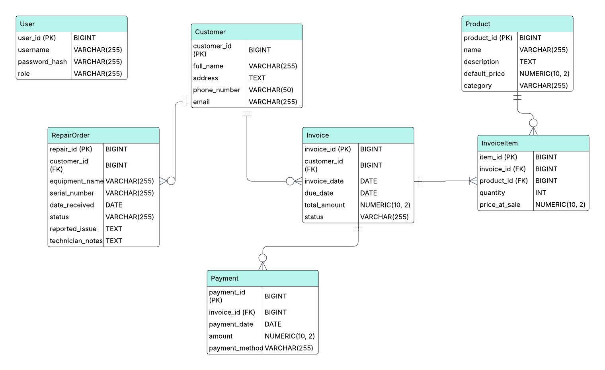

# Systema

**Project Status:** [Back-End Phase Complete]

---

## Table of Contents
1. [Introduction](#introduction)
2. [Problem Statement](#problem-statement)
3. [Features](#features)
4. [Technology Stack](#technology-stack)
5. [System Design](#system-design)
6. [Getting Started](#getting-started)

---

### Introduction
Systema is a comprehensive management system designed for a medical equipment company.
It aims to streamline operations, reduce manual errors
and provide a centralized platform for managing payments, invoices, repairs, and inventory.
This project is being developed for a medical equipment company.
It focuses on solving the challenges of their manual tracking processes.

### Problem Statement
The company currently relies on manual processes, leading to challenges in tracking payments,
managing service requests and maintaining accurate records.
This application addresses these issues by providing a robust, user-friendly, and centralized solution.

### Features
*   **User Management:** Role-based access for administrators and staff.
*   **Customer Management:** A centralized database of all customers.
*   **Invoice and Payment Tracking:** Generation of invoices and recording of payments.
*   **Repair Management:** Logging and tracking of equipment repair requests.
*   **Product Catalog:** A central repository for pre-defined services and parts.
*   **Reporting:** Generation of key business reports.

### Technology Stack
- **Backend:** Java with Spring Boot
- **Database:** MariaDB
- **Build Tool:** Maven
- **Version Control:** Git & GitHub

---

### System Design

#### Database Schema (ERD)
The database is designed to be normalized and robust, ensuring data integrity and scalability.

---

### Getting Started
*(Instructions on how to build and run the project locally will be added here later.)*
